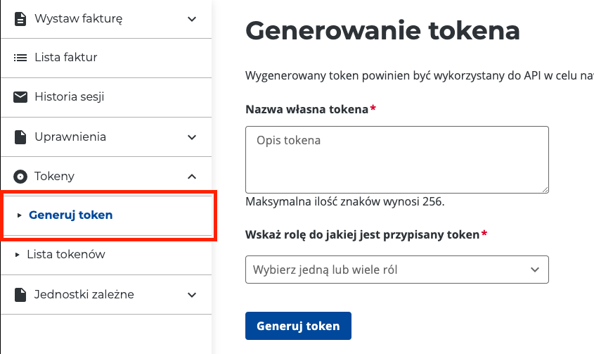

# save-token - Zapisywanie tokenu sesji interaktywnej

::: warning
Do działania niniejszej komendy wymagany jest działający pęk kluczy / keychain w systemie operacyjnym. W przypadku środowisk Windows i Mac nie musisz robić niczego dodatkowego natomiast w przypadku systemu Linux upewnij się, że działa u Ciebie demon implementujący standard `org.freedesktop.secrets.service`.
:::

::: danger
Według doniesień prasowych tokeny mają zostać wycofane z użycia do końca roku 2024. Warto je więc wygenerować do dnia 1 lipca 2024. Ministerstwo planuje wprowadzić inny mechanizm autoryzacji, prawdopodobnie oparty o certyfikaty tym niemniej brak jest na chwilę obecną jakichkolwiek konkretniejszych informacji
:::

Komenda zapisująca token ma znaczenie tylko w przypadku sesji interaktywnej.

```shell
./ksef save-token
Usage of save-token:
  -nip string
        numer NIP podatnika
  -t    użyj bramki testowej
  -token string
        token wygenerowany na środowisku KSeF
```

Opcja ta jest przydatna do późniejszego logowania się do sesji interaktywnej KSeF - tak aby nie trzeba było każdorazowo autoryzować przesyłanych plików.

# Generowanie tokenu w KSeF:



# Przykładowe wywołanie

```shell
./ksef save-token -nip 1111111111 -t -token AAABBB....
```
